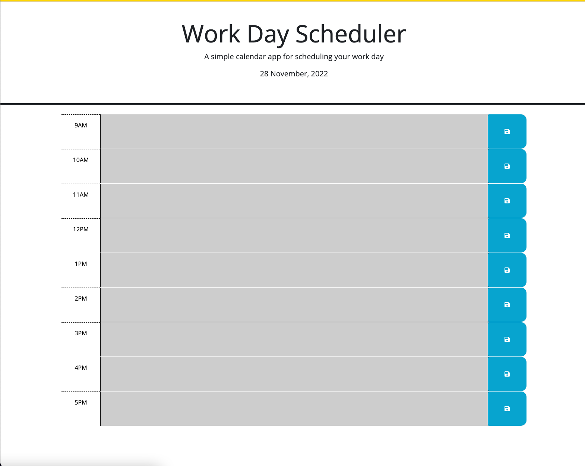

# README
# Mark Barstow / module-5-challenge
# Goals
## Using jQuery and day.js to create a productivity-focused web application
- Third-party APIs are very useful when developing a web application. They are able to provide quick and easy solutions that utilize lines of code that have already been stored in a library. 
- Instead of having to compose all code in JavaScript from scratch, this will allow shortcuts for styling and dom manipulation, in addition to using data from outside sources (day.js provides the ability to use time measurement within JavaScript)

## localStorage utilization in order to have data that persists upon page reload

- This project, like the one before it, required development to include the use of 
        
        localStorage
    to store todos so that they can be called back by the application on reload.
- In order to make sure that the page will display the text that was input and stored using

        localStorage.setItem()
    I had to make sure to call the data back into a variable using 

        localStorage.getItem()
    
# Challenges and Application

- The most challenging part of this assignment was figuring out how to use the div IDs in order to compare them against the current time.
- While I had a lot of trouble utilizing localStorage in the last module project, this time around I felt that it was much easier.

# Webpage Deployment

- the link to the deployed GitHub Pages website is [here](https://marchetype.github.io/module-5-challenge/).

- Screenshot of deployed site:
